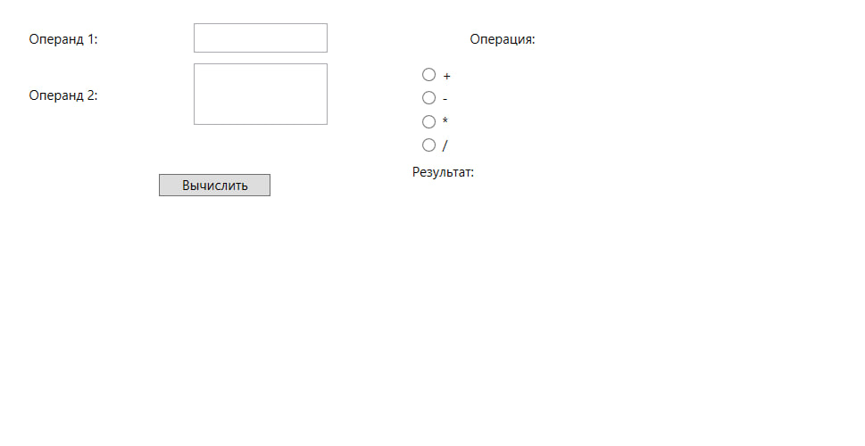

# Способы отладки
В этом проекте были использованы такие способы отладки:
- Точки останова: Использовались для остановки выполнения кода в определенных местах, что позволяло проверять значения переменных и состояние программы.

